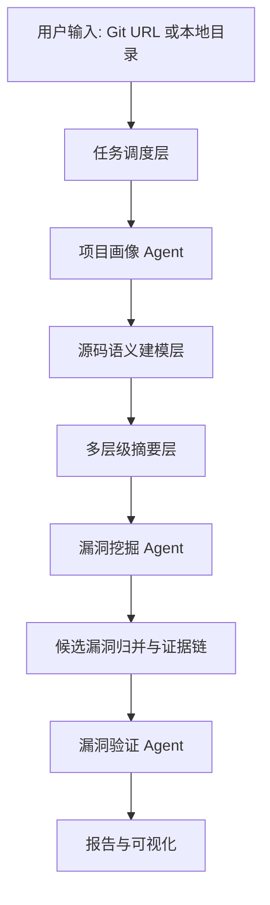

# 系统架构

## 设计目标

`agentic-code-audit` 面向开源项目源码安全审计，目标是构建一套可解释、可扩展、可验证的智能体审计系统。

架构参考两类系统：

- 二进制逆向漏洞挖掘架构：语义恢复、多层摘要、漏洞挖掘、验证闭环。
- DeepAudit：OrchestratorAgent、ReconAgent、AnalysisAgent、VerificationAgent 和工具适配层。

## 总体流水线



当前 MVP 优先实现本地目录输入，后续加入 Git clone、Web API、任务队列和前端。

## 模块分层

### 1. 任务调度层

负责接收任务、初始化配置、调用各 Agent，并把中间结果交给报告层。

当前实现：

- `src/agentic_code_audit/cli.py`
- `src/agentic_code_audit/pipeline.py`

### 2. 项目画像层

负责识别语言分布、框架、包管理文件、入口点、高风险文件和扫描规模。

当前实现：

- `src/agentic_code_audit/agents/profiler.py`

### 3. 工具适配层

工具适配层优先使用 CLI/API，未来可封装为 MCP。

当前工具：

- 内置规则扫描器
- Semgrep
- Gitleaks
- OSV-Scanner
- Bandit
- npm audit

当前实现：

- `src/agentic_code_audit/tools/builtin_patterns.py`
- `src/agentic_code_audit/tools/runner.py`

### 4. 漏洞挖掘 Agent

负责合并工具结果和内置规则结果，并在 DeepSeek 可用时进行 LLM 辅助审计。

输出结构化候选漏洞：

```json
{
  "type": "sql_injection",
  "file": "app.py",
  "line": 42,
  "source": "request.args",
  "sink": "SQL execution",
  "evidence": ["matched rule", "source hint"],
  "confidence": 0.72
}
```

当前实现：

- `src/agentic_code_audit/agents/analysis.py`
- `src/agentic_code_audit/llm.py`

### 5. 漏洞验证层

当前 MVP 先实现静态锚点验证：

- 文件是否存在
- 行号是否存在
- 代码片段是否匹配
- 是否需要动态验证

后续扩展：

- Docker 沙箱启动项目
- HTTP/API payload 验证
- 单元级 PoC 验证
- 请求、响应、日志、截图证据保存

当前实现：

- `src/agentic_code_audit/agents/verification.py`

### 6. 报告层

输出 JSON 机器可读报告和 Markdown 人类可读报告。

当前实现：

- `src/agentic_code_audit/reporting.py`

## DeepSeek 接入

DeepSeek 使用 OpenAI-compatible Chat Completions API。

配置项：

```env
DEEPSEEK_API_KEY=
DEEPSEEK_BASE_URL=https://api.deepseek.com
DEEPSEEK_MODEL=deepseek-chat
```

API Key 只从环境变量或本地 `.env` 读取，`.env` 不进入 Git。

## 后续 MCP 设计

建议把工具层统一封装为 `security-audit-mcp`，暴露：

- `profile_project(path)`
- `run_semgrep(path)`
- `run_gitleaks(path)`
- `run_osv_scanner(path)`
- `run_bandit(path)`
- `scan_builtin_patterns(path)`
- `verify_finding(finding)`
- `write_report(report)`
