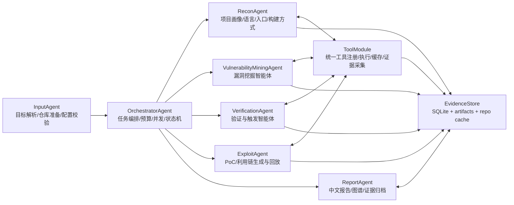
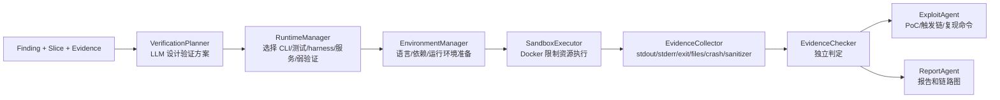

# Agentic Code Audit 完整化改进说明

本文档用于指导下一轮重构：目标不是做一个能跑通的轻量演示，而是把系统改成完整的、DeepAudit 风格的多智能体源码审计平台。所有关键结论必须由“工具证据 + LLM 推理 + 可追溯 artifact”共同支撑，避免让大模型凭空判断。

## 1. 核心总体架构

这里的架构指源码审计系统的核心架构，不是前后端部署架构。前端、后端、SQLite、Docker 只是承载方式，核心系统应按以下模块组织。



### 1.1 Agent 职责

`InputAgent` 负责输入合法性、GitHub URL/本地路径解析、大模型配置校验、任务初始化。大模型是必选能力，当前默认供应商为 DeepSeek、默认模型为 `deepseek-v4-pro`；如果没有可用的大模型 API Key，必须拒绝启动，不允许进入“无模型降级模式”。

`OrchestratorAgent` 是唯一的任务状态机，负责阶段编排、并发调度、超时、取消、失败恢复、重试预算和进度上报。它不直接做漏洞分析，只把上下文分发给具体 Agent。

`ReconAgent` 负责建立项目画像：语言栈、包管理器、构建系统、测试入口、CLI 入口、网络服务入口、关键目录、依赖清单、历史 CVE/OSV 信息、可运行方式。它必须优先调用工具，LLM 只用于解释和补全判断。

`VulnerabilityMiningAgent` 是漏洞挖掘智能体。危险函数定位、切片分析、候选漏洞生成、线索汇聚、漏洞类型判定都属于它的内部流程，不能提升为顶层系统架构。

`VerificationAgent` 负责动态验证。它根据 finding、切片、项目画像和工具证据设计验证方案，生成 harness/输入样例/命令序列，并在 Docker 沙箱中执行。验证结论必须引用真实 stdout、stderr、exit code、生成文件、崩溃日志、 sanitizer 输出等证据。

`ExploitAgent` 负责 PoC 和利用链。它可以复用 VerificationAgent 的执行能力，但目标不同：验证证明“问题存在”，利用链展示“如何触发、造成什么效果、利用边界是什么”。PoC 必须可复现、可归档，并默认限制在本地沙箱中。

`ReportAgent` 负责生成中文报告、Mermaid/前端链路图、PoC 附件、验证证据摘要和风险说明。报告必须能回答：漏洞在哪里、输入从哪里来、经过哪些函数、在哪个 sink 触发、造成什么效果、证据是什么。

`ToolModule` 不是 Agent。它是所有 Agent 共享的工具能力层，提供注册、执行、并发、缓存、超时、日志、artifact 保存和标准化结果。UI 上可以展示“工具调用”，但不应把它命名为 ToolAgent。

`EvidenceStore` 是证据与中间结果存储。所有 Agent 的关键产物都必须结构化入库，并保存原始 artifact，保证报告和 UI 可以回溯。

## 2. 漏洞挖掘具体实现

漏洞挖掘必须采用以下内部流水线：


### 2.1 危险函数定位

目标是找出 source、sink、危险 API、缺失边界检查点、已知危险依赖和可疑配置。不能只靠 LLM 搜索代码。

必须支持的定位来源：

- `rg`/ripgrep：快速定位危险函数、命令执行、文件操作、反序列化、SQL 拼接、网络输入、解析入口。
- Semgrep：执行语言规则和 taint 规则，输出文件、行号、规则 ID、message、metadata。
- tree-sitter 或语言 AST：提取函数边界、调用点、参数名、变量定义、控制条件。
- 依赖扫描：OSV、npm audit、pip-audit、cargo-audit、govulncheck、Trivy 等。
- Secret 扫描：Gitleaks。
- C/C++ 静态工具：cppcheck、clang-tidy、clang-query、CodeQL、Joern、ctags、clangd/libclang。
- Python/JS/Go/Rust 等语言专项工具：Bandit、ESLint security rules、gosec、cargo clippy 等。

输出结构必须包含：

- `file`
- `line`
- `function`
- `language`
- `symbol`
- `kind`: `source | sink | sanitizer | dangerous_api | dependency | config`
- `tool`
- `rule_id`
- `evidence`
- `confidence`

### 2.2 切片分析

切片不是简单截取前后几十行代码，而是围绕危险点提取“与触发漏洞有关的代码上下文”。必须包括：

- source：输入从哪里来，例如 argv、HTTP 参数、文件、网络包、图片元数据、环境变量。
- sink：最终危险操作，例如 `strcpy`、`memcpy`、`system`、SQL 执行、文件读取、反序列化。
- 参数传播：source 如何传到 sink。
- 控制条件：长度检查、类型检查、权限检查、异常处理、早退逻辑。
- sanitizer：过滤、转义、规范化、边界检查。
- 调用链：入口函数到危险函数的调用路径。
- 数据流路径：关键变量在函数内和跨函数的传播。

实现方式应分层：

1. 快速语法切片：基于 tree-sitter/AST 找函数边界、调用点、变量定义和引用。
2. 函数内数据流：围绕 sink 参数回溯变量来源，记录赋值、条件、函数调用。
3. 跨函数调用链：通过 ctags、clangd、CodeQL/Joern 或轻量调用图找调用者和被调用者。
4. LLM 语义解释：让当前配置的大模型解释切片中的输入约束、缺失检查和可能触发条件，但 LLM 不能替代工具提取。

切片输出必须包含：

- `source`
- `sink`
- `function`
- `file`
- `line`
- `call_chain`
- `data_flow`
- `guards`
- `sanitizers`
- `code_excerpt`
- `tool_evidence_ids`

### 2.3 候选漏洞生成

候选漏洞必须由当前配置的大模型基于切片和工具证据生成，但需要强 schema 校验。禁止产生只有“某文件可疑”的候选。

候选必须包含：

- 漏洞标题
- 漏洞类型和候选 CWE
- 文件、函数、行号、sink
- source 到 sink 的触发链
- 触发前提
- 缺失或不足的校验
- 可能影响
- 需要验证的假设
- 关联工具证据

如果缺少函数名、行号、sink、触发条件，应标记为 `invalid_candidate`，不能进入后续验证。

### 2.4 线索汇聚

线索汇聚负责把 Semgrep、CodeQL、rg、AST 切片、依赖扫描和 LLM 候选合并，去重并排序。

汇聚规则：

- 同一 `file + function + sink + source` 合并为同一组。
- 工具证据越多、source/sink 越完整、调用链越清楚，优先级越高。
- 只有 LLM 推测、没有工具证据的候选降级或丢弃。
- 依赖漏洞和源码漏洞分开处理，不能混在同一个 finding 中。
- 对每个候选生成 `evidence_strength`: `strong | medium | weak`。

### 2.5 漏洞类型判定

类型判定要给出：

- 漏洞类型
- CWE
- 严重性
- 置信度
- 可达性
- 可利用性
- 是否进入动态验证
- 为什么进入或不进入验证

等级建议：

- `critical`: 可远程或低权限触发，可能导致 RCE、任意文件写入、认证绕过、大规模敏感数据泄露。
- `high`: 可稳定触发越界写、命令执行、SQL 注入、路径穿越读写、反序列化执行、严重内存破坏。
- `medium`: 需要较强前置条件，影响有限但可证明，如越界读、DoS、受限信息泄露。
- `low`: 防御不足、配置风险、弱校验、难以触发或影响较小。
- `info`: 依赖提醒、代码异味、需要人工确认的安全线索。

等级不是只让 LLM 给结论，必须结合：触发入口、权限、用户可控程度、sink 危险性、校验强度、验证结果和工具证据。

## 3. 漏洞验证与利用架构

验证和利用采用“方案设计 -> 沙箱执行 -> 证据采集 -> 独立判定 -> PoC 归档”的架构。



### 3.1 验证方案设计

`VerificationPlanner` 使用当前配置的大模型，但必须基于结构化输入：

- finding
- 切片
- source/sink
- 项目画像
- 语言、运行方式和环境约束
- 可用工具
- 代码片段
- 已有测试、CLI、服务入口、库入口或示例入口

LLM 可以自由选择验证策略，但必须说明为什么这样选，以及如果当前项目不能单独运行时如何降级：

- 构造输入文件触发 CLI。
- 生成 Python/Bash/JS harness。
- 编译 C/C++ 最小 harness。
- 修改或新增单元测试。
- 启动本地服务并发送请求。
- 使用 mock/stub 隔离外部依赖。
- 对库项目生成最小调用程序或测试用例。
- 对插件/框架项目生成模拟宿主环境。
- 对依赖缺失或服务不可启动项目，进行“静态证据 + 局部执行 + mock harness”的弱化验证。
- 对只能在特定环境运行的项目，生成环境缺口清单和可复现的阻塞证据。
- 使用 ASAN/UBSAN/LSAN、Valgrind、gdb/lldb 捕获崩溃和内存错误。
- 使用 fuzz seed 回放。

但验证计划必须明确：

- 准备步骤
- 执行命令
- 预期现象
- 判定 oracle
- 需要保存的证据
- 失败时的备选方案

### 3.2 自动环境建模、构建与运行时选择

系统不应只围绕 C/C++ 构建设计，也不应让用户手工决定项目如何运行。正确方式是：由 `ReconAgent` 和 `VerificationPlanner` 根据 finding、项目语言、入口、依赖、测试、部署形态和可用工具，自动选择最合适的验证环境和执行策略。用户最多提供偏好、资源限制或禁用某些昂贵步骤。

`EnvironmentManager` 应先建立运行环境画像：

- 语言：C/C++、Python、JavaScript/TypeScript、Go、Rust、Java、PHP、Ruby、C# 等。
- 项目形态：CLI、Web 服务、库、SDK、插件、框架扩展、解析器、后台任务、不可独立运行组件。
- 依赖入口：lockfile、manifest、系统包、数据库、外部服务、编译器、运行时版本。
- 可执行入口：main、tests、examples、scripts、Dockerfile、docker-compose、CI 配置。
- 验证入口：已有测试、最小 harness、mock 宿主、HTTP 请求、CLI 输入、文件解析、依赖漏洞版本证明。

基础沙箱镜像应预装多语言基础环境，减少每次任务临时安装的时间：

- Python、pip、uv、poetry、pytest。
- Node.js、npm、pnpm、yarn、vitest/jest。
- Go、Rust/cargo、Java/Maven/Gradle。
- PHP/composer、Ruby/bundler。
- gcc/g++、clang/clang++、cmake、ninja、make、meson、pkg-config。
- curl、httpie/httpx、sqlite3、常见数据库 client。
- Semgrep、Gitleaks、OSV、Bandit、cppcheck 等基础安全工具。

`BuildManager` 是 `EnvironmentManager` 的子能力，用于需要构建的项目。它应按项目类型识别：

- `CMakeLists.txt`: `cmake -S . -B build -G Ninja`，失败后尝试 Makefile generator。
- `configure`/`autogen.sh`: `./configure && make`。
- `Makefile`: `make -jN`。
- `meson.build`: `meson setup build && ninja -C build`。
- `build.ninja`: `ninja`。
- `package.json`: `npm/pnpm/yarn install` 后执行 test/build/start 脚本。
- `pyproject.toml`/`requirements.txt`: 建立虚拟环境后执行 pytest、模块脚本或 harness。
- `go.mod`: `go test ./...`、`go build` 或生成 Go harness。
- `Cargo.toml`: `cargo test`、`cargo build` 或生成 Rust harness。
- `pom.xml`/`build.gradle`: Maven/Gradle test/build。
- `composer.json`/`Gemfile` 等其他生态入口。

对 C/C++、Rust 等原生代码默认尝试两类构建：

- 普通构建：用于获得 CLI、库、测试目标。
- sanitizer 构建：使用 ASAN/UBSAN/LSAN 捕获内存错误。

如果项目不能独立运行，不能简单结束，也不能让界面长期无进展。系统必须进入弱化验证策略：

- `static_reachability`: 用调用链、source-sink 切片、测试/示例入口证明可达性。
- `local_harness`: 只抽取相关函数和最小依赖，生成局部 harness。
- `mock_runtime`: mock 数据库、HTTP 服务、消息队列、宿主框架或文件系统。
- `dependency_proof`: 对依赖漏洞给出受影响版本、调用位置、可利用条件和官方/OSV 证据。
- `config_proof`: 对配置类问题给出配置项、加载路径、风险条件和复现方式。
- `blocked_with_evidence`: 实在无法执行时保存环境缺口、失败命令、缺失依赖和下一步验证建议。

环境准备或构建失败不是“系统卡住”，必须输出：

- 尝试了哪些运行/构建/验证方式
- 最后一条失败命令
- stdout/stderr 摘要
- 缺失依赖
- 是否还能用 harness、mock、局部执行或静态可达性证明继续
- finding 状态应为 `blocked` 或 `partially_verified`

### 3.3 证据采集与独立判定

`EvidenceChecker` 不能相信 LLM 自述。它必须读取真实执行结果：

- exit code
- stdout
- stderr
- sanitizer 报告
- core/crash 文件
- 生成文件 diff
- HTTP 响应
- 数据库变化
- 日志文件
- 超时和资源限制记录

验证状态统一为：

- `verified`: 证据清楚证明漏洞可触发。
- `exploitable`: 不仅可触发，还能展示明确安全影响或利用效果。
- `partially_verified`: 触发部分条件，但影响或完整链条未完全证明。
- `not_reproducible`: 按当前方案未复现。
- `blocked`: 构建、环境、依赖、入口缺失导致无法继续。
- `false_positive`: 工具或 LLM 线索被证据否定。
- `uncertain`: 证据不足，仍需人工分析。

### 3.4 漏洞利用与 PoC

利用不是攻击真实系统，而是在本地沙箱中展示触发链路和影响。

`ExploitAgent` 应输出：

- PoC 文件或脚本
- 复现命令
- 触发输入
- 预期输出
- 利用链路图
- 安全影响
- 前置条件和限制
- 失败原因和下一步建议

PoC 必须绑定 artifact，不能只写在报告里。对于不能完整利用的 finding，也要生成验证尝试和阻塞原因。

## 4. 工具模块

工具应作为统一模块提供给 Agent 调用，而不是单独的线性阶段。每个 Agent 可以按需调用工具，同一工具结果可缓存复用。

### 4.1 ToolModule 设计

核心接口：

- `ToolRegistry`: 注册工具名称、能力、输入 schema、输出 schema、超时、并发限制。
- `ToolRunner`: 执行命令或库调用，捕获 stdout/stderr/exit code。
- `ArtifactManager`: 保存日志、报告、PoC、构建产物、扫描结果。
- `ToolCache`: 按 repo commit、工具版本、参数 hash 缓存结果。
- `ToolPlanner`: 给 Agent 提供“当前项目可用工具”和推荐调用顺序。
- `SandboxAdapter`: 对需要隔离的工具放入 Docker 沙箱执行。

统一结果结构：

```json
{
  "tool": "semgrep",
  "version": "x.y.z",
  "command": ["semgrep", "--json", "..."],
  "status": "success",
  "exit_code": 0,
  "duration_ms": 1234,
  "stdout_artifact": "artifact-id",
  "stderr_artifact": "artifact-id",
  "parsed": {},
  "summary": "发现 3 个危险点",
  "cache_hit": false
}
```

### 4.2 漏洞相关工具

基础检索与索引：

- ripgrep/rg：快速文本搜索。
- fd/find：文件枚举。
- universal-ctags：函数、符号、调用入口索引。
- tree-sitter：多语言 AST。
- clangd/libclang：C/C++ 语义信息。

静态分析：

- Semgrep：通用规则、taint 规则、自定义危险函数规则。
- CodeQL：跨函数数据流、source/sink 查询。
- Joern：C/C++/Java 等 CPG 分析。
- cppcheck：C/C++ 静态缺陷。
- clang-tidy：C/C++ 代码质量和安全检查。
- Bandit：Python 安全扫描。
- ESLint security plugin：JavaScript/TypeScript 安全扫描。
- gosec：Go 安全扫描。
- cargo clippy/cargo audit：Rust 代码和依赖风险。

依赖与供应链：

- osv-scanner：多语言依赖漏洞。
- npm audit/pnpm audit/yarn audit：Node.js 依赖。
- pip-audit/safety：Python 依赖。
- govulncheck：Go 漏洞。
- cargo-audit：Rust 漏洞。
- Trivy/Grype：容器、文件系统、SBOM 漏洞。
- Syft：SBOM 生成。

Secret 与配置：

- Gitleaks：密钥泄露。
- detect-secrets：密钥泄露辅助。
- checkov/tfsec：IaC 配置风险。

动态验证与利用：

- Docker/Docker Compose：隔离执行。
- gcc/g++、clang/clang++：C/C++ 编译。
- cmake、ninja、make、meson：构建系统。
- ASAN/UBSAN/LSAN：内存错误检测。
- Valgrind：内存错误和泄漏。
- gdb/lldb：崩溃分析。
- pytest/unittest：Python 测试验证。
- node/npm/vitest/jest：JS 验证。
- curl/httpie/httpx：HTTP 触发。
- sqlite3/postgres/mysql client：数据库验证。
- AFL++/libFuzzer/honggfuzz：可选 fuzz 验证。

### 4.3 环境相关工具

项目识别：

- git：clone、checkout、commit hash、diff。
- file：识别二进制/文本。
- jq/yq：解析 JSON/YAML。
- python/node/go/rust/java/php 等运行时版本。
- package manager：pip、poetry、uv、npm、pnpm、yarn、go、cargo、maven、gradle。

系统与资源：

- timeout：执行超时。
- ps/procfs：进程监控。
- du/df：空间监控。
- tar/zip：artifact 打包。
- sha256sum/certutil：文件 hash。

### 4.4 Agent 使用工具的硬性规则

- 每个 finding 至少要关联一个工具证据或代码切片证据。
- LLM 可以提出假设，但必须在 candidate 中标记 `assumption`，并在验证阶段尝试证明。
- 不允许“LLM 看起来像漏洞”直接进入 verified。
- 不允许 verification_method 只写自然语言，必须引用命令、输出、artifact。
- 每个 Agent 调 LLM 前应尽量先调用工具缩小上下文。
- 工具失败要记录失败原因，不能静默降级。

### 4.5 工具分阶段安装策略

工具不是一次性全部安装完成，而是随系统能力逐步补齐。每个阶段只安装该阶段真正会调用、会解析、会保存证据的工具，避免把开发重点变成环境安装排错。

每次新增工具时必须同步更新：

- `scripts/install_tools.ps1`: Windows 本地 `.tools/` 安装、版本固定、版本检查。
- `docker/sandbox/Dockerfile`: Docker 沙箱内安装或明确标记 optional。
- `ToolRegistry`: 注册工具名称、能力、语言适配、required/optional、version args、parser。
- `ToolParsers`: 如果工具有结构化输出，必须增加 parser。
- 测试：至少覆盖可用性检测、缺失时状态、parser 输出。
- 文档：说明安装方式、用途、是否必需、失败降级策略。

分阶段工具范围：

- 阶段二，工具模块基础与核心工具闭环：安装/确保 `rg`、`semgrep`、`gitleaks`、`osv-scanner`、`bandit`、`npm audit`、`trivy`。目标是让 ToolRegistry、ToolRunner、ToolParser、ToolCache 跑通。
- 阶段三/四，随 Recon 和漏洞挖掘补静态分析工具：接入 `cppcheck`、`clang-tidy`、`pip-audit`、`gosec`、`cargo-audit`；`CodeQL`、`Joern` 先做 optional 检测和 registry 预留，只有在切片/数据流实现真正调用时再安装。
- 阶段五，随动态验证/利用补运行环境工具：安装/确保 `cmake`、`ninja`、`gcc/g++`、`clang/clang++`、ASAN/UBSAN/LSAN 支持、`valgrind`、`gdb/lldb`、`pytest`、`vitest/jest`、`curl`、`sqlite3` 和常见数据库 client。
- 后续增强，重型工具：`CodeQL`、`Joern`、`Trivy`、`Syft`、`AFL++`、`libFuzzer` 等需要配套缓存、资源限制和长任务进度后再安装。

## 5. 耗时问题与并行方案

当前很多步骤耗时长，主要原因通常是：全仓库扫描串行执行、LLM 对每个切片逐个请求、切片范围过大、没有缓存、构建步骤缺少超时、前端没有进度心跳。

### 5.1 并行执行

可并行的任务：

- Recon 阶段的语言识别、依赖识别、入口识别、文件索引。
- Semgrep、Gitleaks、OSV、Bandit、cppcheck 等工具扫描。
- 不同危险点的切片分析。
- 不同候选漏洞的 LLM 生成和分类。
- 不同 finding 的验证计划生成。
- 互不依赖的 harness 执行。

并发实现建议：

- 后端使用 `asyncio` + `ProcessPoolExecutor`/`ThreadPoolExecutor`。
- CPU 密集型 AST/切片走进程池。
- I/O 密集型工具执行走异步 subprocess。
- LLM 请求批量化，限制最大并发，避免触发限流。
- Docker 验证任务设置全局并发上限，避免机器资源耗尽。

### 5.2 缓存与增量

必须缓存：

- clone 后的 repo commit。
- 文件索引和函数索引。
- 工具扫描原始结果。
- AST/符号表。
- 切片结果。
- LLM 输出，按 prompt hash + model + slice hash 缓存。
- 构建结果和失败日志。

缓存 key 应包含：

- repo URL/path
- commit hash
- tool name/version
- parameters
- relevant file hash
- model name

### 5.3 分层预算

不要一上来对全仓库所有危险点做深度分析。应分层：

1. 快速扫描：得到危险点和粗排序。
2. Top-N 深度切片：只对高风险点做跨函数切片。
3. Top-M 候选生成：只让 LLM 处理证据足够的切片。
4. Top-K 动态验证：优先验证高严重性、高可达性、高证据强度候选。
5. 长任务后台继续，前端实时展示进度和剩余队列。

### 5.4 前端进度与取消

前端必须显示：

- 当前 Agent。
- 当前子步骤。
- 已完成/总数。
- 最近工具调用。
- 最近 LLM 调用。
- 当前耗时。
- 如果 30 秒没有新事件，显示“仍在运行，当前阶段为 ...”，而不是让用户误以为卡死。
- 停止按钮应触发后端取消标记，后端各阶段必须定期检查取消状态。

## 6. 需要修正的当前设计问题

- `ToolAgent` 应改为 `ToolModule` 或 `ToolService`，作为所有 Agent 的共享能力层。
- `SecurityToolRunner` 不应作为独立线性阶段固定运行，而应被 Recon/Mining/Verification 按需调用。
- 漏洞挖掘的五个步骤应作为 `VulnerabilityMiningAgent` 内部流程，不应出现在顶层架构图里。
- 语言、运行环境、构建方式和验证入口不应要求用户手工选择，系统应根据项目画像和 finding 自动制定方案；失败时给出清晰的环境缺口、弱化验证结果或 blocked 证据。
- Finding 列表应显示 verification status、evidence strength、confidence、是否进入动态验证。
- 链路图 effect 不能为空，必须从漏洞类型、sink、验证证据生成。
- 已跑任务应进入历史记录，点击历史任务只查看，不自动重新执行。
