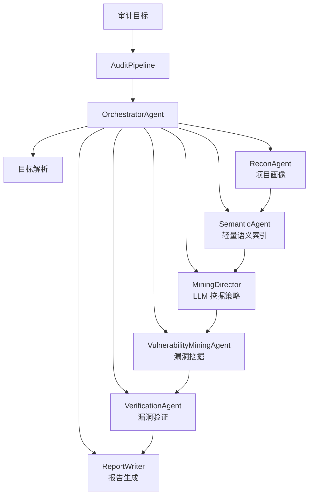

# 漏洞审计核心架构

本文描述当前系统中与漏洞挖掘、验证和证据生成相关的核心架构，不展开前后端页面实现细节。

## 一、总体架构

系统采用结构化流水线架构：先用确定性的工具和规则保证覆盖，再让 LLM 在关键阶段提供策略、语义判断、验证方案和报告表达。LLM 不能绕过预算、安全策略、构建授权或证据结论。



整体数据流：

```text
target
  -> TargetResolver
  -> ProjectProfile
  -> SemanticIndex
  -> MiningStrategy
  -> DangerousFunction
  -> ProgramSlice
  -> VulnerabilityCandidate
  -> Finding
  -> VerificationResult
  -> AuditReport
```

系统把问题分成五类风险域处理：

| 风险域 | 内容 | 验证方式 |
|---|---|---|
| `source_code` | 源码中的注入、内存安全、路径遍历、反序列化等 | 静态链路、动态验证、harness、checker |
| `dependency` | 依赖漏洞、SBOM、OSV/Trivy/npm/pip audit 结果 | 静态核对，不做运行时复现 |
| `supply_chain_config` | GitHub Actions、Dependabot 等配置风险 | 配置检查 |
| `secret` | 密钥泄露 | secret checker |
| `environment/other` | 未归一或弱语义问题 | 默认降级处理 |

## 二、具体实现

### 1. 任务编排

`AuditPipeline` 是任务入口，负责调用 `OrchestratorAgent` 并写出报告。`OrchestratorAgent` 负责串联目标解析、项目画像、语义索引、挖掘策略、漏洞挖掘、验证和报告生成。

任务运行时会持续写入事件、工具运行记录、finding、verification 和 artifact。前端通过 API 和 SSE 展示进度、事件、漏洞详情、验证证据和报告。

### 2. 项目画像

`ReconAgent` 负责生成项目画像，主要包括：

- 主要语言和文件规模；
- 包管理器和依赖文件；
- 构建系统，如 CMake、Autotools、Make、npm、pip、Go、Maven、Gradle、Composer；
- 入口线索，如 CLI、HTTP 服务、测试入口、C/C++ `main` 函数；
- 可用工具和工具运行位置。

项目画像用于决定后续扫描工具、构建方式、验证入口和报告上下文。

### 3. 语义索引

`SemanticAgent` 生成轻量语义索引，包括函数、类、路由、入口点等基础结构。当前语义索引不是独立智能体式深度代码图，也不是完整调用图。它主要辅助危险点归属函数、触发链路展示和候选排序。

### 4. LLM 挖掘策略

`MiningDirector` 是 LLM 参与漏洞挖掘的主要入口。它可以读取文件、搜索代码、追踪变量、列目录、找调用者，并输出结构化 `MiningStrategy`：

- 推荐工具；
- 关注目录；
- 优先函数；
- parser entry；
- taint source；
- harness 候选；
- oracle 建议；
- 噪声排除建议；
- 动态验证优先级。

这些建议只能影响优先级和战术选择，不能直接生成最终证据结论。

### 5. 危险函数定位

`DangerousFunctionLocator` 合并三类信号：

1. 内置规则：Python、JavaScript、C/C++ 危险 API 和通用 pattern；
2. 工具结果：Semgrep、Bandit、cppcheck、clang-tidy、gosec、Trivy、OSV、Gitleaks 等；
3. LLM 策略：关注目录、优先函数、噪声排除。

输出的 `DangerousFunction` 更准确地说是“安全相关 anchor”，不全是源码危险函数。依赖漏洞、secret 和配置风险也会被包装为 anchor，这也是后续需要优化的重点之一。

### 6. 切片分析

`SliceAnalyzer` 将 anchor 转换为 `ProgramSlice`。当前实现是函数级或局部窗口级切片：

- Python 用 AST 找函数范围；
- JavaScript/TypeScript 优先用 tree-sitter，失败后用正则；
- C/C++ 优先用 ctags，失败后用正则；
- 找不到函数范围时取危险行前后上下文。

切片会推断：

- source，如 HTTP 参数、CLI 参数、stdin、read/fread/recv、环境变量；
- sink 和 sink 参数；
- guard、sanitizer、definition；
- C/C++ 中的 size、offset、index 变量；
- 简化 call chain 和 data flow。

当前切片不是完整跨函数 taint analysis，也不是全程序控制流/数据流证明。它能组织候选证据，但不足以单独证明漏洞可行。

### 7. 候选生成与分类

`CandidateGenerator` 把 slice 转成 `VulnerabilityCandidate`。工具型 slice 可以进入 LLM 批量候选生成，规则型 slice 目前存在 deterministic fallback。`ClueAggregator` 会合并重复候选，`VulnerabilityClassifier` 再根据类型、风险域、source/sink、工具证据和策略优先级生成 `Finding`。

当前质量问题主要集中在这里：弱规则、工具提示、依赖/配置/源码问题混在一起，部分候选没有足够强的 source-to-sink 证据。

### 8. 验证

`VerificationAgent` 对 finding 进行静态验证、动态验证和 checker 判定。动态验证由 LLM 或 fallback 生成结构化验证方案，再由系统校验后执行。

验证结论分层：

| 结论 | 含义 |
|---|---|
| `verified` | 真实 CLI/runtime 命中 oracle |
| `harness_reproduced` | 生成 harness 命中 oracle，只代表局部复现 |
| `partial_dynamic_proof` | micro proof 命中 oracle，只证明模式 |
| `partially_verified` | 静态链路有一定证据 |
| `unverified` | 证据不足 |
| `blocked` | 构建、环境、预算或策略阻塞 |
| `rejected` | 静态或 checker 证据否定 |

验证永远默认无网络。C/C++ native build 需要任务级开关授权。

### 9. 报告与证据

`ReportWriter` 输出 Markdown 和 JSON 报告。报告中保留 finding、验证方案、执行命令、stdout/stderr、exit code、checker 结果、PoC/runbook 和 artifact 路径。前端主要通过 `audit-report.json` 展示历史任务和调查详情。
