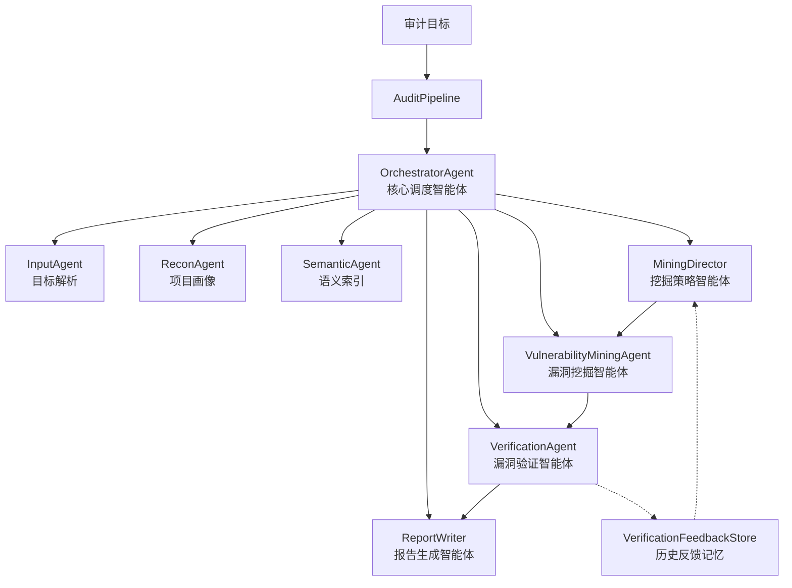

# 漏洞审计核心架构

本文描述 agentic-code-audit 当前与漏洞挖掘、验证、证据生成相关的核心架构，不包含前端页面、后端 API 形态等展示层内容。

## 一、总体架构

系统采用“目标解析 -> 项目画像 -> 语义索引 -> LLM 策略规划 -> 漏洞挖掘 -> 静态验证 -> 动态验证 -> 报告归档”的流水线架构。核心入口是 `AuditPipeline`，实际调度由 `OrchestratorAgent` 完成。

智能体架构图如下：



整体数据流如下：

```text
Input Target
  -> TargetResolver
  -> ReconAgent
  -> SemanticAgent
  -> MiningDirector
  -> VulnerabilityMiningAgent
      -> DangerousFunctionLocator
      -> SliceAnalyzer
      -> CandidateGenerator
      -> ClueAggregator
      -> VulnerabilityClassifier
  -> VerificationAgent
      -> StaticVerifier
      -> EnvironmentManager
      -> BuildManager
      -> DynamicPlanner
      -> VerificationPlanner
      -> PocGenerator
      -> RuntimeManager / SandboxExecutor
      -> EvidenceChecker
      -> ExploitAgent
  -> ReportWriter
  -> audit-report.json / audit-report.md / mining-debug.json / pocs / exploits
```

### 1. 分层目标

系统把漏洞审计拆成三类问题分别处理：

1. 漏洞挖掘：从仓库中发现可能的 source/sink、危险函数、配置风险、依赖风险和候选漏洞。
2. 漏洞验证：判断 finding 是否有足够静态证据，是否值得动态执行，是否能通过 CLI、runtime、harness 或 micro proof 复现。
3. 证据报告：把挖掘候选、静态判断、动态执行、checker 结果、PoC artifact 和限制条件统一落盘。

### 2. 风险域划分

系统用 `risk_domain` 区分漏洞处理方式：

```text
source_code          -> 可进入静态验证和动态验证
dependency           -> 依赖/SBOM/OSV 类静态验证
supply_chain_config  -> CI、workflow、配置安全静态验证
secret               -> secret/checker 类静态验证
environment/other    -> 默认静态处理，若静态验证识别出 source/sink，可重分类为 source_code
```

动态验证只面向源码类漏洞。依赖、配置、密钥类问题不进入 runtime/harness 复现链路，避免把版本命中或配置风险误包装成可执行 PoC。

### 3. LLM 参与位置

LLM 不是单独替代规则扫描，而是参与以下关键决策：

```text
MiningDirector      -> 多轮代码调查、重点目录/函数/工具选择
CandidateGenerator  -> 生成或补充漏洞候选
VulnerabilityClassifier -> 辅助严重性判断
StaticVerifier      -> 对静态证据进行保守复核
DynamicPlanner      -> 生成结构化 verification_recipe
PocGenerator        -> 优先生成目标相关 PoC payload / harness
VerificationPlanner -> 根据 recipe 生成局部验证 harness
ReportWriter        -> 汇总验证逻辑和证据描述
```

LLM 的输出必须经过系统校验。LLM 不能绕过 native build 开关、sandbox 网络策略、预算限制，也不能把推断结果直接升级为 `verified`。

### 4. 验证分级

当前验证结论分为：

```text
verified                 -> 真实目标 runtime/CLI 命中 oracle
harness_reproduced       -> 生成 harness 命中 oracle，不等价于完整目标验证
partial_dynamic_proof    -> micro proof 命中 oracle，仅证明局部模式
partially_verified       -> 静态链路较强，但没有完整动态复现
unverified               -> 未能证明
rejected                 -> 静态或 checker 判定不成立
blocked                  -> 环境、构建、预算、策略阻塞
static_only              -> 非源码类或仅适合静态验证
uncertain                -> 证据不足或动态结果未命中
```

当前系统已经实现“源码类 finding 进入动态验证队列”的策略，但动态验证质量仍依赖 harness/PoC 生成质量。最近测试暴露出 Python harness 生成中 JSON `null` 写入 Python 字面量的问题，以及 Node.js/PHP 场景下 PoC 语言不匹配的问题。

## 二、具体实现

### 1. AuditPipeline 与 OrchestratorAgent

`AuditPipeline.run()` 是任务入口，负责调用 `OrchestratorAgent.run()` 并写出报告 artifact。

`OrchestratorAgent` 负责串联各个 agent：

```text
InputAgent           -> 解析 Git/local 输入，准备 runs/repos 工作区
ReconAgent           -> 识别语言、项目类型、构建系统、入口文件
SemanticAgent        -> 构建轻量语义索引
MiningDirector       -> LLM 多轮调查，生成 mining strategy
VulnerabilityMiningAgent -> 执行漏洞挖掘
VerificationAgent    -> 执行静态/动态验证和 PoC 生成
ReportWriter         -> 输出 JSON、Markdown 和 debug 文件
```

任务模式由 `AuditBudget.for_mode()` 控制，`quick/standard/deep` 主要影响 anchor、slice、candidate、finding、LLM call、dynamic verification 数量上限。

### 2. TargetResolver

`TargetResolver` 负责把输入转换成本地审计目录：

```text
Git URL     -> clone/fetch 到 runs/repos
local path  -> 直接使用或复制
branch/tag  -> 解析并 checkout
```

它需要处理 GitHub tree URL、分支/tag、浅克隆、已有目录更新等问题。目标源码不会被验证阶段修改，harness、日志和 PoC artifact 写入 reports 目录。

### 3. ReconAgent

`ReconAgent` 生成 `ProjectProfile`，主要字段包括：

```text
languages
frameworks
project_type
build_systems
entry_points
package_managers
test_commands
profile_summary
```

这些信息后续用于：

1. 选择工具和规则。
2. 判断 runtime 类型，如 `cpp_cli`、`python_test`、`node_test`、`php_test`。
3. 判断构建系统，如 CMake、Autotools、Make、npm。
4. 给 LLM 和动态验证 planner 提供项目上下文。

### 4. ToolRunner 与工具统一探测

`ToolRunner` 是工具执行和可用性探测的中心。

工具来源包括：

```text
semgrep
bandit
pip-audit
osv-scanner
trivy
gitleaks
cppcheck
clang-tidy
ctags
语言/构建工具，如 cmake、make、gcc、php、node、java、go
```

工具可用性通过 `ToolAvailability` 表达，字段包括：

```text
available
path/version
execution_location
container
network_policy
```

这样可以区分 backend 可用和 sandbox 可用，避免用本机 `PATH` 错误判断 sandbox 能力。

### 5. MiningDirector

`MiningDirector` 是 LLM 驱动的调查指挥层。它通过多轮 exploration 获取仓库上下文，然后产生 `MiningStrategy`。

策略内容包括：

```text
focus_directories
priority_functions
tool_selections
parser_entries
harness_candidates
suggested_oracles
build_attempt
rationale
validation_notes
```

这些策略只影响挖掘和验证优先级，不能绕过预算、安全策略、构建授权或验证结论规则。

### 6. VulnerabilityMiningAgent

`VulnerabilityMiningAgent` 是漏洞挖掘主流程，内部包含五个核心阶段。

#### 6.1 DangerousFunctionLocator

从工具结果和内置规则中发现危险 anchor：

```text
命令执行: system, shell_exec, exec, subprocess, child_process
代码执行: eval, Function, assert, unserialize
SQL: mysqli_query, mysql_query, query, execute
文件路径: open, fopen, readfile, include, file_get_contents
C/C++ 内存: strcpy, memcpy, sprintf, gets, pointer arithmetic
配置/依赖/secret: workflow、manifest、lockfile、secret pattern
```

输出是 `DangerousFunction` 列表。

#### 6.2 SliceAnalyzer

围绕危险点抽取 `ProgramSlice`，内容包括：

```text
source
sink
function_name
call_chain
data_flow
guards
missing_guards
sanitizers
context/code_excerpt
tool_run_refs/artifact_refs
```

切片是后续判断 source-to-sink 是否成立的主要证据。

#### 6.3 CandidateGenerator

基于 slice、工具结果和 LLM 生成 `VulnerabilityCandidate`。

候选来源分为：

```text
rule
tool
llm
```

候选会记录 validity、confidence、trigger_conditions、missing_checks、evidence_refs 等字段。

#### 6.4 ClueAggregator

对候选做去重、合并和排序，输出聚合候选。它会过滤 `invalid_candidate`，并尽量合并同一文件、同一 sink、同一漏洞类型的重复线索。

当前仍存在重复规则 sink 导致同一代码行多次进入报告的问题，例如同一 PHP `shell_exec` 被多个 Semgrep rule id 标成多个 finding。

#### 6.5 VulnerabilityClassifier

把候选转换为最终 `Finding`。

主要工作：

```text
确定 vulnerability_type
确定 risk_domain
计算 score/severity/evidence_strength
生成 chain_graph
生成 recommendation 和初始 exploit_payloads
决定 should_verify / needs_verification
```

当前策略是：只要属于源码类动态可验证类型，就不在 mining 阶段用分数提前拦截，而是交给 StaticVerifier 做下一步门禁。

### 7. StaticVerifier

`StaticVerifier` 是动态验证前的硬门禁。它不执行 PoC，只判断静态证据是否足够。

输出是 `StaticVerificationResult`：

```text
static_status
reachability
dynamic_eligible
reason
risk_domain
evidence_refs
rule_checks
llm_review
```

静态状态包括：

```text
plausible
weak_static_proof
needs_more_context
likely_false_positive
blocked_static
static_only
```

动态验证门禁是：

```text
risk_domain == source_code
static_status in {plausible, weak_static_proof}
finding.should_verify == true
```

对于 mining 阶段被标成 `other/environment` 但证据中存在明显 source/sink 的 finding，`StaticVerifier` 会重分类，例如：

```text
exec-use / shell_exec       -> command_injection
tainted-sql / mysqli_query  -> sql_injection
file_get_contents / ../     -> path_traversal
eval / unserialize          -> code_execution
```

重分类后会同步设置 `should_verify=true` 和 `needs_verification=true`，使其能够进入动态验证队列。

### 8. VerificationAgent

`VerificationAgent.verify()` 是验证主流程。

执行顺序：

```text
1. 对所有 finding 做 StaticVerifier
2. LLM 可选复核静态证据
3. 计算 dynamic_eligible
4. 按 max_dynamic_verifications 选择前 N 个动态验证目标
5. EnvironmentManager 判断 runtime
6. BuildManager 按开关决定是否 native build
7. DynamicPlanner 生成动态计划和 verification_recipe
8. PocGenerator 生成 PoC artifact
9. RuntimeManager/SandboxExecutor 执行
10. EvidenceChecker 判定结果
11. ExploitAgent 归档 exploit/replay
12. 生成 VerificationResult
```

`enable_native_build` 是任务级参数，优先于全局 `AUDIT_AUTO_BUILD_NATIVE`。native build 未开启时，C/C++ 构建必须返回 `build_disabled`，不能因为 sandbox 工具存在而自动构建。

### 9. EnvironmentManager

`EnvironmentManager` 根据 `ProjectProfile` 和 finding 判断 runtime 类型。

主要类型：

```text
cpp_cli
cpp_harness
python_test
node_test
php_test
java_test
go_test
http_service
library_harness
static_blocked
```

它同时检查 sandbox/backend 工具是否可用，并生成 `EnvironmentProfile`：

```text
runtime_type
available_tools
missing_tools
environment_gaps
can_execute
execution_location
```

### 10. BuildManager

`BuildManager` 负责 native 构建决策和执行，主要服务 C/C++ 项目。

构建策略包括：

```text
existing_binary
cmake_build
autotools_build
make_build
meson_build
no_build_required
no_build_possible
```

构建默认无网络。只有显式配置 `AUDIT_BUILD_NETWORK_ENABLED=true` 时，构建容器才允许临时联网。验证容器始终无网络。

`BuildDecision` 记录：

```text
should_attempt
blocked_reason
network_policy
commands
exit_code
stdout/stderr/log path
binary_path
evidence
```

稳定 blocked reason 包括：

```text
build_disabled
sandbox_unavailable
missing_tool
missing_dependency
network_disabled
wrong_build_system
build_failed
binary_not_found
```

### 11. DynamicPlanner 与 verification_recipe

`DynamicPlanner` 将静态验证结果、环境、构建结果和 LLM 建议合并为 `DynamicVerificationPlan`。

计划字段包括：

```text
runtime_type
build_strategy
poc_strategy
oracle
status
blocked_reason
commands
fallbacks
verification_recipe
```

`verification_recipe` 是 LLM 或 fallback 生成的结构化验证方案，最小字段包括：

```text
target_function
source
sink
preconditions
preferred_build
runtime_entry
fallback_harness
micro_proof
oracle
expected_signal
limitations
```

如果完整 runtime 或 native build 阻塞，系统可以进入局部验证路径，但局部验证不能升级成完整 `verified`。

### 12. PocGenerator

`PocGenerator` 负责生成 PoC 输入、说明、runbook 和 harness artifact。

优先级：

```text
1. LLM payload plan
2. LLM recipe 中的 payload/harness
3. template fallback
```

fallback 只能生成“待补充模板”，不能生成伪 PoC 或 `manual-validation-payload`。当前实现已经移除早期的全 A payload，但仍存在部分语言场景下 fallback payload 与目标语言不匹配的问题，例如 Node.js `eval()` 使用了 Python 风格 payload。

### 13. VerificationPlanner 与 harness

`VerificationPlanner` 根据 finding 和 dynamic plan 生成可执行 harness。

目标是：

```text
在无网络 sandbox 中局部复现 source/sink/oracle
记录 command/stdout/stderr/exit_code
保存 harness 源码和执行日志
```

支持方向包括：

```text
C/C++ harness
Python harness
Node.js harness
PHP harness
Java harness
Go harness
shell wrapper
micro proof
```

当前仍需修复的实现问题：

```text
Python harness 不能直接嵌入 JSON null，应使用 json.dumps + json.loads 或 Python repr。
node_test 应优先生成 Node.js harness，而不是统一退回 Python harness。
PHP/Web 场景应优先生成 HTTP 请求或 PHP harness。
```

### 14. RuntimeManager 与 SandboxExecutor

`RuntimeManager` 将 `PocPlan` 和 `DynamicVerificationPlan` 转换成实际执行。

`SandboxExecutor` 使用 Docker 无网络临时容器执行：

```text
docker run --rm
  --network none
  --memory 1g
  --cpus 1
  --volumes-from agentic-code-audit-sandbox
  -w <sandbox workdir>
  agentic-code-audit-sandbox:local
  <command>
```

执行证据包括：

```text
command.json
stdout.log
stderr.log
exit_code.txt
pre_hashes.json
post_hashes.json
changed_files.json
```

本地 fallback 不允许产生 `verified` 结论。Docker 缺失时应返回明确 blocked reason。

### 15. EvidenceChecker

`EvidenceChecker` 根据漏洞类型分发 checker。

示例：

```text
CommandInjectionChecker
SQLInjectionChecker
PathTraversalChecker
MemorySafetyChecker
DependencyChecker
GenericChecker
```

checker 只能基于真实执行输出、静态证据和 oracle 判断。LLM 文本不能单独让结果变成 `verified`。

### 16. ExploitAgent

`ExploitAgent` 把 PoC、验证结果和 replay 说明归档到：

```text
reports/<task>/exploits/<finding_id>/
```

典型文件：

```text
exploit.md
replay.sh
```

它用于报告和后续人工复核，不应修改被审计仓库源码。

### 17. ReportWriter 与 artifact

`ReportWriter` 输出：

```text
audit-report.json
audit-report.md
mining-debug.json
pocs/<finding_id>/*
exploits/<finding_id>/*
```

`audit-report.json` 保留完整结构化数据，`audit-report.md` 面向人工阅读。

报告中应区分：

```text
静态证据
验证方案
动态执行证据
checker 结果
PoC 代码/命令
待补充模板
局限性
```

当没有真实 PoC 或执行 artifact 时，报告不应把模板字段写成“PoC 代码”。当前报告层仍需继续优化这个展示边界。

### 18. mining-debug.json

`mining-debug.json` 直接来自真实 `MiningResult`，用于排查挖掘链路。

主要字段：

```text
tool_anchor_count_by_tool
anchor_count_by_risk_domain
candidate_validity_breakdown
candidate_source_distribution
aggregation_input_count
aggregation_output_count
finding_count_by_type
finding_count_by_risk_domain
verification_queue_count
budget
budget_usage
```

它能快速判断问题发生在：

```text
工具扫描阶段
候选生成阶段
聚合阶段
finding 分类阶段
静态验证入队阶段
动态验证执行阶段
```

### 19. 当前实现边界

当前系统已经具备：

```text
多工具挖掘
LLM 策略调查
source/sink 切片
候选聚合
静态验证门禁
任务级 native build 开关
Docker 无网络 sandbox
PoC/harness artifact 保存
报告和 mining-debug 输出
```

但仍有几个核心改进点：

```text
1. harness 生成需要按语言专属实现，避免统一 Python fallback。
2. LLM PoC 需要优先生成目标协议/语言相关 payload。
3. dynamic_plan 需要完整写回 VerificationResult，避免报告中显示 null。
4. dependency_vulnerability 在 standard 模式下需要限额，避免挤占源码漏洞。
5. finding 去重仍需加强，尤其是同一 sink 多条 Semgrep 规则重复命中。
6. checker oracle 需要和 proof_level 对齐，避免执行了但结论仍不清晰。
7. 报告应严格区分真实 PoC 与待补充模板。
```
