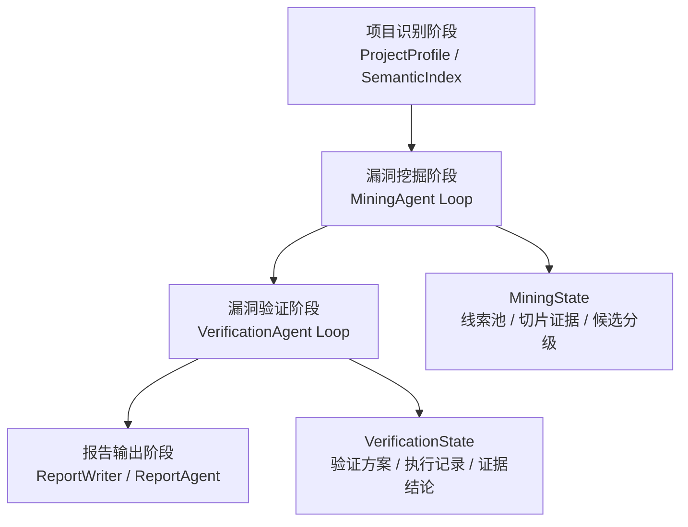
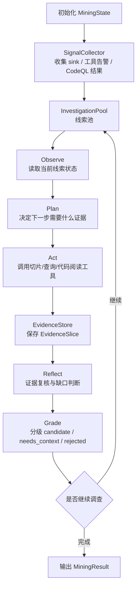
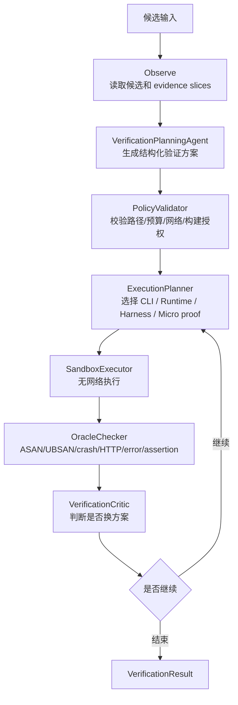

# 漏洞挖掘与验证 Agent 架构重构方案

## 1. 背景与目标

当前系统的顶层流程是合理的：

```text
项目识别 -> 漏洞挖掘 -> 漏洞验证 -> 报告输出
```

这个流程符合安全审计的基本工作方式，也便于控制预算、保存证据和生成报告。当前问题不在顶层流程，而在阶段内部。以漏洞挖掘阶段为例，现有 `VulnerabilityMiningAgent` 内部仍然是一条固定流水线：

```text
工具选择 -> 工具执行 -> 危险函数定位 -> 切片 -> 候选生成 -> 聚合 -> 分类
```

这类实现更接近 pipeline，而不是真正的 agent。真正的 agent 阶段应该能够围绕一个线索反复观察、计划、调用工具、补证据、复核和分级，而不是一次性执行完所有步骤。

本方案的目标是：

1. 保留顶层阶段边界，不推翻现有审计主流程。
2. 将漏洞挖掘阶段内部从固定流水线改为线索驱动的 agent loop。
3. 将切片分析从单次固定步骤改为 agent 可反复调用的证据工具。
4. 将漏洞验证阶段改为方案驱动、可重试、可降级的验证 agent loop。
5. 让工具承担程序分析，agent 负责任务规划、工具选择、补上下文、证据解释和分级。
6. 所有结论必须来自结构化证据，LLM 不能凭空补链路、不能改变安全策略和验证结论。

## 2. 总体阶段架构

顶层仍然保留四个阶段：


阶段内部改为 agent 化：



本方案不要求立刻引入 LangGraph、AutoGen 或 CrewAI。更稳妥的做法是先在本项目内部实现轻量的 `AgentLoop`、`State`、`Action` 和 `Router` 抽象，等状态模型稳定后，再考虑是否迁移到 LangGraph 这类框架。

## 3. 漏洞挖掘阶段 Agent 架构

### 3.1 阶段职责

漏洞挖掘阶段负责从项目中发现高价值漏洞线索，并输出可以进入验证阶段的候选。它不应该直接把危险函数命中包装成漏洞。

输入：

- `ProjectProfile`
- `SemanticIndex`
- 工具可用性
- 历史验证反馈
- 审计模式和预算

输出：

- `investigation_items`：全部调查过的线索
- `evidence_slices`：所有切片证据
- `candidates`：可进入漏洞验证的候选
- `needs_context_items`：高价值待确认线索
- `rejected_items`：明确低价值或安全的线索
- `tool_runs`：工具执行记录
- `agent_trace`：agent 每轮决策和理由

### 3.2 内部架构



### 3.3 主要组件

| 组件 | 类型 | 职责 |
|---|---|---|
| `MiningAgent` | agent loop | 漏洞挖掘阶段的总控，围绕线索池循环决策 |
| `SignalCollector` | deterministic node | 统一收集危险 sink、工具告警、CodeQL 结果和规则命中 |
| `InvestigationPool` | state manager | 管理所有待调查线索、优先级、状态和预算 |
| `SlicePlanningAgent` | LLM agent | 判断当前线索需要哪类切片或补充证据 |
| `ToolExecutionNode` | deterministic node | 执行 CodeQL、Joern、Semgrep、rg、read_file、find_callers 等工具 |
| `EvidenceNormalizer` | deterministic node | 将 SARIF、CPG path、本地 AST/lexical 结果归一化为 `EvidenceSlice` |
| `EvidenceCriticAgent` | LLM agent + rule gate | 基于结构化证据判断是否连通、是否缺上下文、是否明显安全 |
| `CandidatePromoter` | deterministic node | 将强证据线索提升为候选，弱证据保留为待确认 |

### 3.4 核心数据结构

#### 3.4.1 `InvestigationItem`

`InvestigationItem` 表示一个围绕 sink 的调查对象。它不是漏洞，只是线索。

```text
InvestigationItem:
  id
  signal_ids
  file_path
  line_start
  function_name
  language
  sink
  sink_kind
  suspected_vuln_type
  priority
  state
  evidence_slice_ids
  missing_context
  decisions
  last_action
  budget_used
```

建议状态：

```text
new
needs_slice
needs_source
needs_callers
needs_guard_analysis
needs_tool_retry
needs_llm_review
candidate
needs_context
rejected
```

#### 3.4.2 `EvidenceSlice`

`EvidenceSlice` 表示一次工具或分析后端返回的切片证据。

```text
EvidenceSlice:
  id
  item_id
  backend              # codeql / joern / semgrep / local_ast / local_lexical / llm_read
  source
  source_kind          # cli_arg / stdin / file_content / network / request / env / parameter / unknown
  sink
  sink_kind
  dataflow_path
  call_path
  guards
  sanitizers
  missing_guards
  size_facts
  alias_facts
  control_facts
  status
  confidence
  gaps
  raw_artifact_refs
```

#### 3.4.3 `MiningFindingCandidate`

`MiningFindingCandidate` 是漏洞挖掘阶段交给验证阶段的候选。

```text
MiningFindingCandidate:
  id
  item_id
  title
  vuln_type
  severity
  primary_slice_id
  supporting_slice_ids
  evidence_level
  reason
  assumptions
  verification_hint
```

### 3.5 切片分析的新定位

切片分析仍然存在，而且比现在更重要。变化是：切片不再是固定流水线中的单次步骤，而是 agent 可以反复调用的证据工具。

当前方式：

```text
危险函数定位 -> 一次性 SliceAnalyzer -> CandidateGenerator
```

目标方式：

```text
发现 sink 线索
-> 判断缺什么证据
-> 调用 CodeQLSliceTool / JoernSliceTool / LocalSliceTool / CallerTraceTool
-> 得到 EvidenceSlice
-> 根据 evidence gaps 决定继续切、降级或输出候选
```

例如：

```text
只有 sink
-> 调 CodeQL source-to-sink query

得到 parameter_to_sink
-> 调 caller graph / Joern backward slice / find_callers

得到 source_to_sink，但 guard 不清楚
-> 调 guard analysis / read_file / LLM semantic review

发现 resize/alloc 等长保护
-> 标记 guarded_safe，降级或 reject
```

### 3.6 切片分级

`EvidenceSlice.status` 建议使用以下分级：

| 状态 | 含义 | 默认处理 |
|---|---|---|
| `source_to_sink_proven` | 工具证明真实外部 source 到 sink 的数据流 | 进入候选 |
| `entry_source_to_sink_proven` | 外部入口、调用链、数据流均成立 | 高优先级候选 |
| `parameter_to_sink` | 函数参数到 sink，但参数来源未证明 | 待调查 |
| `entry_parameter_to_sink` | 可从入口到达函数，参数到 sink，但外部可控性未证明 | 高价值待确认 |
| `entry_reachable_no_taint` | 入口可达，但没有 taint 证据 | 待调查或降级 |
| `sink_only` | 只有危险 sink | 默认不进入报告 |
| `guarded_safe` | 发现有效 sanitizer、bounds check、resize/alloc 保护 | reject |
| `tool_error` | 工具失败或结果不可解析 | 可重试或 fallback |
| `tool_disagreement` | 多个工具结论冲突 | 待复核 |

漏洞候选分级：

| 候选等级 | 条件 | 是否进入验证 |
|---|---|---|
| `confirmed_static_candidate` | 强切片 + 缺失防护 + 无有效 sanitizer | 是 |
| `high_value_needs_verification` | 强或中强证据，但利用条件未确认 | 是 |
| `needs_context` | 有价值但缺 caller/source/guard 关键上下文 | 默认展示在待确认区，可选验证 |
| `rejected` | sink-only、明显安全、工具弱告警、LLM 否定 | 否 |

### 3.7 Agent 决策规则

`MiningAgent` 每轮围绕一个 `InvestigationItem` 决策：

```text
if item has no slice:
    run best slice backend

if best_slice == sink_only:
    run caller/source query if priority high else reject

if best_slice == parameter_to_sink:
    run caller trace or CodeQL/Joern backward query

if best_slice has source_to_sink and guard unclear:
    run guard/sanitizer/size analysis

if size facts show alloc/resize before bounded copy:
    mark guarded_safe or needs_context

if evidence strong and no effective sanitizer:
    promote candidate

if evidence medium and useful:
    mark needs_context

if evidence weak or clearly safe:
    reject
```

### 3.8 工具后端策略

工具选择由 agent 决定，但需要有默认策略。

| 语言 | 首选工具 | 辅助工具 | fallback |
|---|---|---|---|
| C/C++ | CodeQL、Joern | clangd/compile_commands、cppcheck、ctags | 本地 lexical/AST-like slicer |
| Python | CodeQL、Semgrep taint | AST dataflow、Bandit | 本地 AST |
| JavaScript/TypeScript | CodeQL、Semgrep taint | TypeScript AST、框架路由识别 | 本地 lexical |
| PHP | Semgrep taint、Psalm/Psalm taint | PHP AST、Composer metadata | 本地 source/sink 规则 |
| Java | CodeQL | Semgrep、Maven/Gradle graph | 本地 call graph |
| Go | CodeQL | go call graph、gosec | 本地 lexical |

短期优先级：

1. CodeQL 从普通工具结果提升为切片后端。
2. C/C++ 接入 Joern 或预留 Joern backend 接口。
3. 保留现有 `SliceAnalyzer` 作为 fallback，不再作为唯一主路径。

## 4. 漏洞验证阶段 Agent 架构

### 4.1 阶段职责

漏洞验证阶段负责对挖掘阶段输出的候选进行可复现验证。它不负责凭空发明漏洞，也不能把 LLM 推断当作 verified。

输入：

- `MiningFindingCandidate`
- `EvidenceSlice`
- `ProjectProfile`
- 构建/运行环境
- 用户授权，如 `enable_native_build`

输出：

- `VerificationResult`
- PoC / harness / runbook artifact
- build log、execution log、stdout、stderr、exit code
- verdict 和 proof level

### 4.2 内部架构



### 4.3 验证子组件

| 组件 | 类型 | 职责 |
|---|---|---|
| `VerificationAgent` | agent loop | 验证阶段总控 |
| `VerificationPlanningAgent` | LLM agent | 根据 evidence slice 生成验证 recipe |
| `PolicyValidator` | deterministic node | 校验路径、预算、网络、native build 授权 |
| `BuildAgent` | deterministic + LLM-assisted | 选择构建系统、执行构建、记录日志 |
| `PoCPlannerAgent` | LLM agent | 生成真实 PoC 方案、输入格式、命令或 harness |
| `HarnessAgent` | LLM agent + compiler | 在完整 runtime 不可用时生成局部 harness |
| `SandboxExecutor` | deterministic node | 无网络、限资源执行命令 |
| `OracleChecker` | deterministic node | 判断 sanitizer、crash、assert、HTTP、stderr 信号 |
| `VerificationCriticAgent` | LLM agent + rule gate | 判断失败原因和是否换验证方案 |

### 4.4 验证循环

验证阶段不应是一条固定路径。它应该能根据执行结果调整策略：

```text
生成 recipe
-> 校验 recipe
-> 尝试完整 runtime / CLI
-> 如果没有真实 PoC，禁止执行模板输入
-> 如果 CLI 输入格式错误，回到 PoCPlannerAgent
-> 如果完整构建失败，转 harness
-> 如果 harness 只能证明局部模式，标 partial_dynamic_proof
-> 如果 oracle 命中，标 verified 或 harness_reproduced
-> 如果证据不足，标 blocked / uncertain / unverified
```

### 4.5 验证结论分级

| 结论 | 条件 |
|---|---|
| `verified` | 真实目标程序 / CLI / runtime 命中 oracle |
| `harness_reproduced` | 生成 harness 复现了目标链路关键行为 |
| `partial_dynamic_proof` | micro proof 或局部模式证明成立，但不代表目标程序可利用 |
| `partially_verified` | 静态强证据成立，动态证据不足 |
| `unverified` | 未能复现，也无足够动态证据 |
| `blocked` | Docker、构建、依赖、预算、授权等阻塞 |
| `rejected` | 证据证明不可达、已防护或误报 |

### 4.6 PoC 规则

必须明确区分真实 PoC 和模板：

| 类型 | 是否可执行 | 是否可进入报告 PoC 代码 |
|---|---|---|
| `llm_generated_poc` | 可以 | 可以 |
| `tool_generated_poc` | 可以 | 可以 |
| `harness_poc` | 可以 | 可以，但标注 harness |
| `manual_template` | 不可作为验证输入 | 只能显示“待补充模板” |
| `fallback_payload` | 仅调试 | 不得冒充真实 PoC |

规则：

1. `template_fallback` 不得被喂给真实 CLI 当作 PoC。
2. 没有目标协议和输入格式时，动态验证应进入 `poc_not_generated` 或转 harness。
3. LLM 生成 PoC 必须包含输入格式、执行命令、预期 oracle 和限制。
4. 本地 fallback 只能生成待补充模板，不能生成看似可利用的假 PoC。

## 5. 漏洞挖掘详细修改计划

### 阶段 1：数据模型重构

目标：先把“线索、切片、候选、finding”分清。

任务：

1. 新增 `InvestigationItem`、`EvidenceSlice`、`MiningFindingCandidate`、`AgentDecision`。
2. 保留 `ProgramSlice` 作为兼容层，增加 adapter：

```text
EvidenceSlice -> ProgramSlice
MiningFindingCandidate -> VulnerabilityCandidate / Finding
```

3. `MiningResult` 增加：

```text
investigation_items
evidence_slices
needs_context_items
rejected_items
agent_trace
```

4. `mining-debug.json` 展示所有分层统计。

验收：

- 旧前端和报告仍能读取 `ProgramSlice`。
- 新 debug 能看到每个线索为什么变成 candidate、needs_context 或 rejected。

### 阶段 2：AgentLoop 基础设施

目标：实现阶段内部 agent loop，而不是固定函数串联。

任务：

1. 新增通用结构：

```text
AgentState
AgentAction
AgentObservation
AgentDecision
AgentLoop
```

2. 每轮执行必须记录：

```text
item_id
thought / rationale
action
tool_name
tool_input
observation_summary
state_change
budget_delta
```

3. 支持 deterministic action 和 LLM action。
4. 支持预算停止、最大轮次停止、无进展停止。

验收：

- 一个固定 fixture 能复现完整 agent trace。
- LLM 不可用时 deterministic fallback 仍能工作，但不会默认确认漏洞。

### 阶段 3：SignalCollector 改造

目标：危险函数定位只输出 signal，不直接输出漏洞候选。

任务：

1. 将 `DangerousFunctionLocator` 输出语义重命名或适配为 `Signal`。
2. 每个 signal 增加：

```text
signal_kind
signal_strength
rule_strength
risk_domain
source_tool
```

3. 工具告警分级：

```text
security_taint
security_bug
lint
sca
secret
config
```

4. 默认不把 `lint`、`sink_only`、弱 C/C++ API 命中直接加入候选。

验收：

- `memcpy`、`std::copy`、`memcmp` 只作为线索。
- 配置风险不进入源码漏洞挖掘主池。

### 阶段 4：EvidenceSlice 后端接口

目标：把切片变成工具后端。

任务：

1. 定义统一接口：

```text
SliceBackend.run(item, project_state) -> list[EvidenceSlice]
```

2. 实现后端：

```text
LocalSliceBackend       # 现有 SliceAnalyzer 适配
CodeQLSliceBackend      # CodeQL SARIF / path evidence
SemgrepSliceBackend     # Semgrep taint / rule evidence
JoernSliceBackend       # 先预留接口，可后续接入
CallerTraceBackend      # find_callers / semantic index
GuardAnalysisBackend    # sanitizer / guard / size facts
```

3. `EvidenceNormalizer` 统一字段和状态。
4. 所有原始工具输出必须保存 artifact ref。

验收：

- CodeQL 结果能转成 `EvidenceSlice`。
- 本地 fallback 结果也能转成 `EvidenceSlice`。
- 同一 item 可以有多个 evidence slice。

### 阶段 5：MiningAgent 线索池循环

目标：用 agent loop 代替当前固定挖掘流水线。

任务：

1. 初始化 `InvestigationPool`：

```text
signals -> items
按 source tool、sink danger、路径优先级排序
```

2. 每轮选择最高价值 item。
3. 根据 item 状态决定 action：

```text
run_slice
run_caller_trace
run_guard_analysis
read_context
ask_llm_triage
promote_candidate
mark_needs_context
reject
```

4. 每轮更新 `EvidenceSlice` 和 item state。
5. 预算到达后输出当前快照，而不是丢弃未完成线索。

验收：

- Exiv2 中 `std::copy` 不能只因 sink 命中进入 finding。
- `parameter_to_sink` 能留在 `needs_context_items`。
- 高价值线索能继续触发 caller/source 补证据。

### 阶段 6：EvidenceCritic 与分级规则

目标：把“是否有价值”从候选生成中拆出来。

任务：

1. 实现 deterministic critic：

```text
source_to_sink 是否成立
source 是否真实外部入口
sink 参数是否依赖 source
是否存在有效 sanitizer
是否存在 size/bounds/alloc/resize 保护
工具是否冲突
```

2. 实现 LLM critic：

输入必须是结构化 `EvidenceSlice`，不塞长上下文。

输出：

```json
{
  "decision": "promote | needs_context | reject",
  "reason": "...",
  "missing_context": [],
  "evidence_slice_ids": [],
  "confidence": 0.0
}
```

3. LLM 只能降级或要求补上下文，不能绕过强制证据门槛直接 verified。

验收：

- `buf.alloc(nBytes); std::copy(..., buf.begin())` 这类模式被识别为 guarded 或 needs_context。
- `needs_more_context` 不进入最终 finding，但展示在待确认区。

### 阶段 7：候选输出与兼容

目标：保证新挖掘架构能接上现有验证和报告。

任务：

1. `MiningFindingCandidate` 转旧 `Finding`。
2. `needs_context_items` 转前端“高价值待确认线索”。
3. `rejected_items` 只进入 debug，不进入报告主列表。
4. 报告中显示：

```text
最终漏洞
高价值待确认线索
被过滤/拒绝摘要
```

验收：

- 旧报告格式可用。
- 前端不会因为完整 evidence graph 太大而卡顿。
- `audit-report.json` 控制体积，重型 trace 写 artifact。

### 阶段 8：回归测试与评估

目标：用真实项目验证质量提升。

测试项目：

```text
Exiv2
json-c
libtiff
libarchive
sqlite
DVWA
maccms10
```

指标：

| 指标 | 目标 |
|---|---|
| sink-only 进入 finding 数 | 接近 0 |
| needs_context 保留数 | 可见且可解释 |
| final finding 误报率 | 明显下降 |
| CodeQL/本地切片融合 | 可追溯 |
| report JSON 体积 | 明显下降 |
| 验证模板误执行 | 0 |

## 6. 推荐实施顺序

优先顺序如下：

1. 新增数据模型和 adapter，不破坏旧流程。
2. 将现有 `SliceAnalyzer` 包装为 `LocalSliceBackend`。
3. 将 CodeQL 结果提升为 `CodeQLSliceBackend`。
4. 实现 `InvestigationPool` 和最小 `MiningAgent` loop。
5. 实现 deterministic `EvidenceCritic`。
6. 接入 LLM critic。
7. 替换 `VulnerabilityMiningAgent.run()` 内部固定流水线。
8. 再重构验证阶段 agent loop。

这样风险最低：先保留旧产物，逐步把内部从 pipeline 换成 agent loop。

## 7. 最终状态

重构完成后，系统仍然是：

```text
项目识别 -> 漏洞挖掘 -> 漏洞验证 -> 报告输出
```

但漏洞挖掘阶段内部变成：

```text
线索池 -> agent 决策 -> 工具切片 -> 证据复核 -> 分级 -> 循环补证据
```

漏洞验证阶段内部变成：

```text
验证方案 -> 策略校验 -> 执行 -> oracle 判断 -> 失败调整 -> 结论分级
```

这比把所有阶段都做成自由对话式多 agent 更适合本系统：顶层可控，阶段内部足够 agentic，证据链可追溯，安全边界也更清晰。
