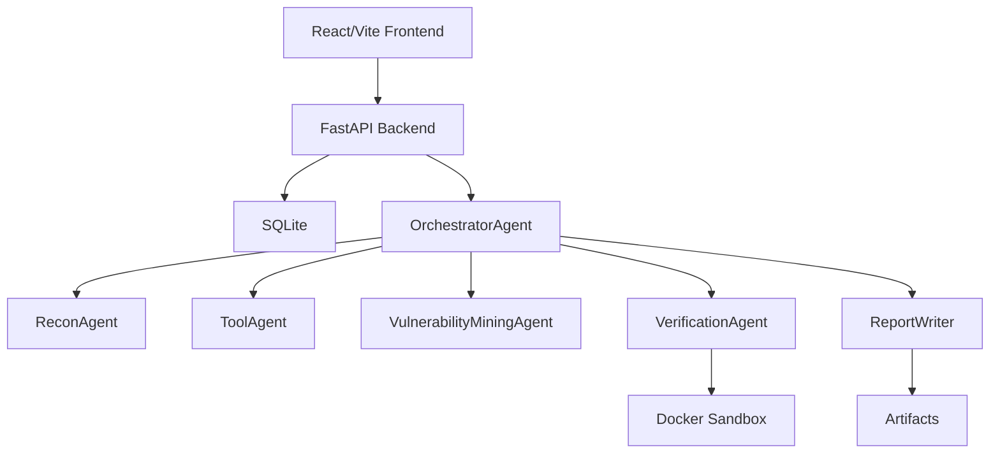

# 系统架构

`agentic-code-audit` 面向源码安全审计，目标是构建 DeepAudit 风格的可解释、可验证、多 Agent 协作平台。

## 总体结构



## 审计流水线

```text
项目输入
  -> Git/本地路径解析
  -> 项目画像
  -> 外部工具与内置规则扫描
  -> 漏洞挖掘智能体
  -> LLM 验证方案设计
  -> Docker sandbox 执行 harness/PoC
  -> 证据检查
  -> 报告和链路图
```

## 后端

后端位于 `src/agentic_code_audit/server.py`，提供：

- `POST /api/tasks`
- `POST /api/tasks/{task_id}/start`
- `POST /api/tasks/{task_id}/cancel`
- `GET /api/tasks`
- `GET /api/tasks/{task_id}`
- `GET /api/tasks/{task_id}/events`
- `GET /api/tasks/{task_id}/events/history`
- `GET /api/tasks/{task_id}/findings`
- `GET /api/tasks/{task_id}/findings/{finding_id}`
- `GET /api/tasks/{task_id}/report.md`
- `GET /api/artifacts/{artifact_id}`

任务队列目前使用进程内后台线程。SQLite 起步，后续可以替换为 Redis worker 或独立 worker 服务。

## 数据模型

SQLite 表：

- `tasks`
- `agent_events`
- `tool_runs`
- `dangerous_functions`
- `program_slices`
- `candidates`
- `findings`
- `verification_attempts`
- `artifacts`

模型定义位于 `src/agentic_code_audit/models.py`，其中 finding 会携带 `chain_graph`，用于前端和报告展示触发链路。

## Agent 分层

- `Input/Recon`: 解析目标、clone 仓库、生成项目画像。
- `Tool`: 调用 Semgrep、Gitleaks、OSV-Scanner、Bandit、npm audit 和内置规则。
- `VulnerabilityMining`: 漏洞挖掘智能体，内部包含危险函数定位、切片分析、候选生成、线索汇聚、漏洞类型判定。
- `Verification`: 由 DeepSeek 设计 harness/PoC，在 sandbox 执行并保存证据。
- `Report`: 生成 Markdown/JSON 报告。

## DeepSeek

DeepSeek 是必选项，默认模型：

```env
DEEPSEEK_MODEL=deepseek-v4-pro
```

关键阶段都会调用 DeepSeek：切片解释、候选漏洞生成、线索汇聚、漏洞类型判定、验证方案设计、报告总结。

## Sandbox

`docker/sandbox/Dockerfile` 提供验证运行环境，包含 Python/Bash/JS/C/C++ 编译运行能力和常用安全工具。验证时默认禁用网络并限制资源，保存：

- harness 脚本
- 执行命令
- 退出码
- stdout
- stderr
- 生成文件
- checker 结论

运行时逻辑上分为三种模式，共用 `agentic-code-audit-sandbox:local` 镜像：

- `analysis`: 复用 Compose 中长期运行的无网络 sandbox，执行 cppcheck、clang-tidy、ctags 等分析工具。
- `build`: 使用临时容器执行 CMake 构建，默认 `--network none`；只有显式设置 `AUDIT_BUILD_NETWORK_ENABLED=true` 才允许构建容器联网。
- `verification`: 使用临时容器执行 CLI/harness，固定无网络并限制 CPU、内存和超时。Docker 不可用时返回 `missing_docker`，本地执行结果不能升级为 verified。

`/api/tools` 为每个工具返回 `execution_location`、`container` 和 `network_policy`，backend、Recon、MiningDirector 使用同一份工具可用性结果。

## 漏洞验证闭环

验证模块采用 `VerificationAgent -> RuntimeManager -> EvidenceCollector -> EvidenceChecker` 的闭环，而不是让 LLM 直接宣布漏洞成立。

- `VerificationAgent`: 理解 finding，分析 source/sink、可达性、触发条件和保护措施。
- `VerificationPlanner`: 先生成验证计划，明确 runtime_type、entry_point、trigger_type、Oracle 和 max_attempts。
- `BuildManager`: 系统根据语言、构建文件和 finding 类型制定构建计划，但只有任务的 `enable_native_build` 开关开启后才允许执行；沙箱可用性不能绕过该授权。
- `RuntimeManager`: 对 CLI、Service、Harness 三类运行形态分别执行。C/C++ 优先 CMake + ASAN/UBSAN；无法构建时输出 blocked 和构建/决策证据，不等价于漏洞不存在。
- `EvidenceCollector`: 保存命令、退出码、stdout、stderr、HTTP 响应、PoC、runbook、构建日志和 verification.json。
- `EvidenceChecker`: 独立读取真实执行证据，只有命中 Oracle 才输出 `verified` 或 `partially_verified`；否则输出 `not_reproducible`、`blocked`、`false_positive` 或 `uncertain`。

## 前端

前端位于 `frontend/`，采用 React/Vite。页面参考 DeepAudit 的 AgentAudit 形态：

- 顶部任务状态栏
- 左侧任务创建和 Agent 树
- 中间 SSE 实时日志
- 右侧 finding 和验证详情
- 报告预览和下载
